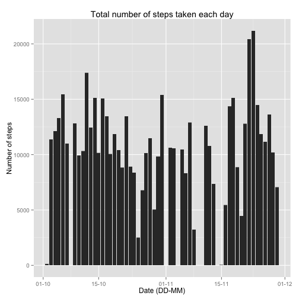
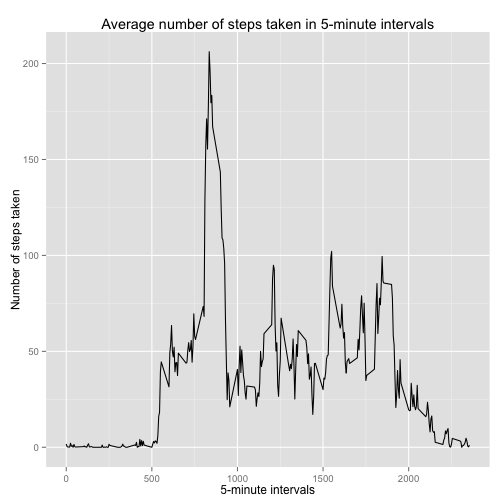
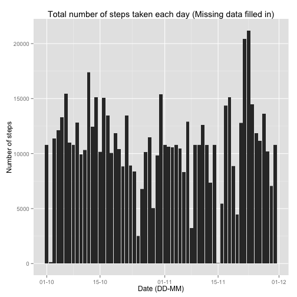

## Loading and preprocessing the data


```r
unzip(zipfile="activity.zip")
```

```
## Warning in unzip(zipfile = "activity.zip"): error 1 in extracting from zip
## file
```

```r
data = read.csv("activity.csv", colClasses = c("integer", "Date", "factor"))
datawona = na.omit(data)
```

## What is mean total number of steps taken per day?

Histogram of the total number of steps taken each day


```r
library(ggplot2)
library(scales)
ggplot(datawona, aes(date, steps)) + geom_histogram(stat = "identity") + scale_x_date(labels = date_format("%d-%m")) + labs(title = "Total number of steps taken each day", x = "Date (DD-MM)", y = "Number of steps")
```

 

Mean total number of steps taken each day:


```r
steps = aggregate(datawona$steps, list(Date = datawona$date), FUN = "sum")$x
mean(steps)
```

```
## [1] 10766.19
```

Median total number of steps taken each day:

```r
median(steps)
```

```
## [1] 10765
```

## What is the average daily activity pattern?

Time series plot of the 5-minute interval and the average number of steps taken, averaged across all days

```r
averagesteps = aggregate(datawona$steps, list(interval = as.numeric(as.character(datawona$interval))), FUN = "mean")
names(averagesteps)[2] = "mean"
ggplot(averagesteps, aes(interval, mean)) + geom_line() + labs(title = "Average number of steps taken in 5-minute intervals", x = "5-minute intervals", y = "Number of steps taken")
```

 

The 5-minute interval, on average across all the days in the dataset,  that contains the maximum number of steps:


```r
averagesteps[averagesteps$mean == max(averagesteps$mean), ]
```

```
##     interval     mean
## 104      835 206.1698
```

## Imputing missing values

Total number of rows with NAs in the dataset:


```r
sum(is.na(data))
```

```
## [1] 2304
```

New data consists of original NAs filled with mean value for the 5-minute interval


```r
newdata = data 
for (i in 1:nrow(newdata)) {
    if (is.na(newdata$steps[i])) {
        newdata$steps[i] <- averagesteps[which(newdata$interval[i] == averagesteps$interval), ]$mean
    }
}
```

New histogram of the total number of steps taken each day


```r
ggplot(newdata, aes(date, steps)) + geom_histogram(stat = "identity") + scale_x_date(labels = date_format("%d-%m")) + labs(title = "Total number of steps taken each day (Missing data filled in)", x = "Date (DD-MM)", y = "Number of steps")
```

 

New mean total number of steps taken each day:


```r
newsteps <- aggregate(newdata$steps, 
                           list(Date = newdata$date), 
                           FUN = "sum")$x
mean(newsteps)
```

```
## [1] 10766.19
```

New median total number of steps taken each day:


```r
median(newsteps)
```

```
## [1] 10766.19
```

Comparison of old and new means and medians:


```r
mean(steps) - mean(newsteps)
```

```
## [1] 0
```

```r
median(steps) - median(newsteps)
```

```
## [1] -1.188679
```

The new mean of total steps taken per day is the same as that of the old mean, while the new median of total steps taken per day is greater than that of the old median. This is due to the NA values, which were treated as zeros, being replaced by the higher mean values.

## Are there differences in activity patterns between weekdays and weekends?

Introducing new factor variable with two levels: weekday or weekend, in dataset


```r
newdata$weekdays <- factor(format(newdata$date, "%A"))
levels(newdata$weekdays)
```

```
## [1] "Friday"    "Monday"    "Saturday"  "Sunday"    "Thursday"  "Tuesday"  
## [7] "Wednesday"
```

```r
levels(newdata$weekdays) <- list(weekday = c("Monday", "Tuesday",
                                             "Wednesday", 
                                             "Thursday", "Friday"),
                                 weekend = c("Saturday", "Sunday"))
```

Panel plot containing a time series plot  of the 5-minute interval and the average number of steps taken, averaged across all weekday days or weekend days


```r
averagenewsteps <- aggregate(newdata$steps, 
                      list(interval = as.numeric(as.character(newdata$interval)), 
                           weekdays = newdata$weekdays),
                      FUN = "mean")
names(averagenewsteps)[3] <- "mean"
library(lattice)
xyplot(averagenewsteps$mean ~ averagenewsteps$interval | averagenewsteps$weekdays, 
       layout = c(1, 2), type = "l", 
       xlab = "Interval", ylab = "Number of steps")
```

 
